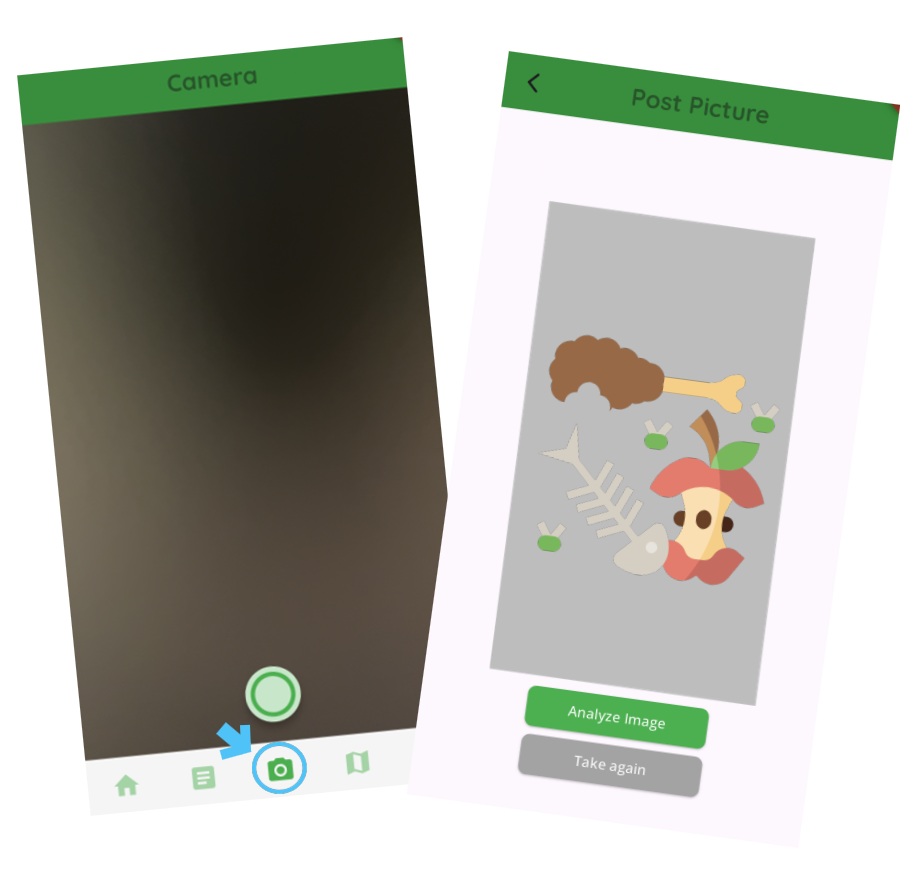
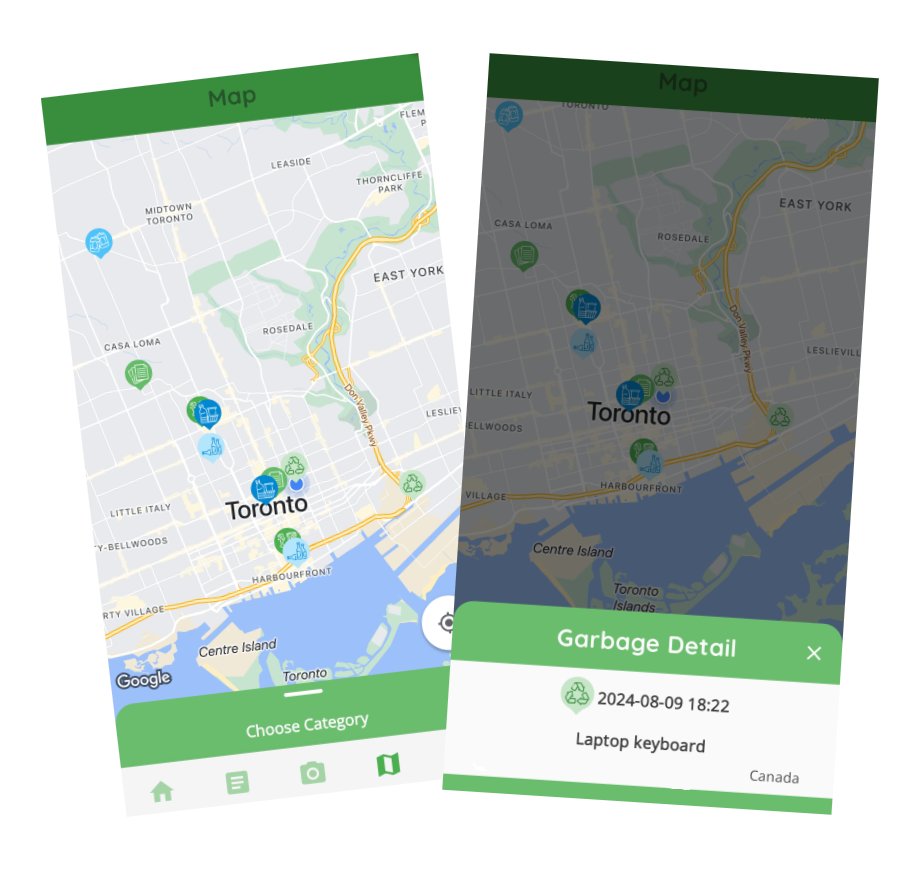
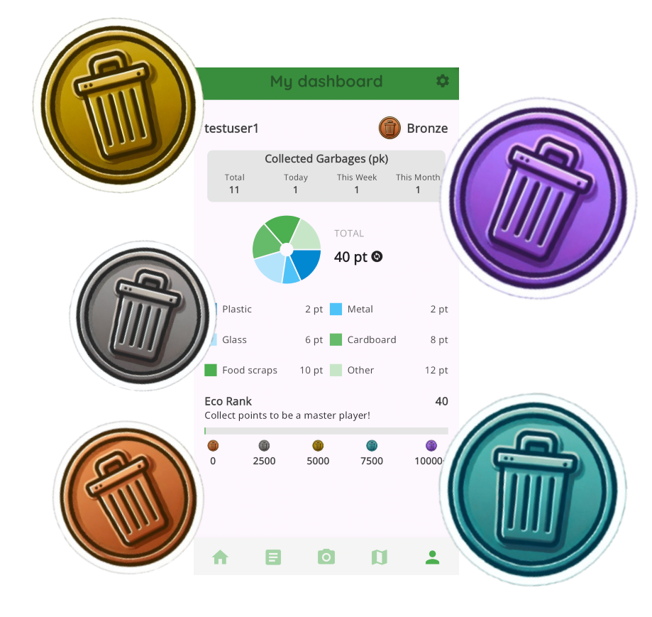
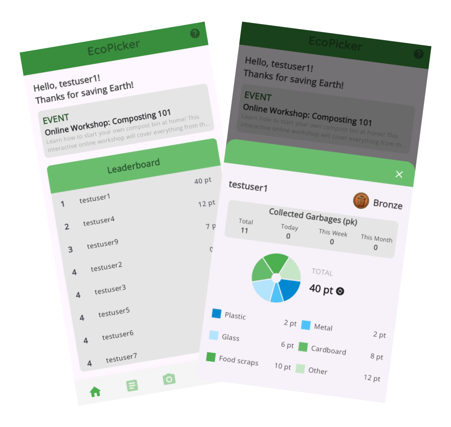

# Eco Picker🌱

Eco Picker is a mobile app that encourages users to participate in trash-picking challenges by tracking collected waste and visualizing environmental impact.

🎥 Demo Video: https://www.youtube.com/watch?v=8reS2H0D3zo
## Why This Project?

Eco Picker was created to encourage small environmental actions through gamification. 
The goal was to combine mobile technology and behavioral motivation to promote sustainable habits.

## Features

- Track trash collection activities
- Location-based map visualization
- User challenge and ranking system
- Real-time waste category logging
- Environmental impact statistics
 
## Tech Stack

### Frontend
- Flutter (Mobile UI Development)
- Dart

### APIs & Integrations
- Google Maps API (Location & Marker Visualization)
- REST API Integration (Backend Communication)

## App Preview

### Capture & Analyze Waste


Users can take photos of waste and analyze categories using image recognition.

---

### Map Tracking


Collected garbage is visualized on a live map using Google Maps API.

---

### Dashboard & Ranking


Users earn points and view environmental impact statistics.

---

### Events & Community


Gamified challenges and events encourage continuous participation.

## Prerequisites

- IDE
- Flutter SDK
  
Andriod
- Android Studio
 
iOS
- Xcode
- CocoaPods
- iOS 14

## Getting Started

### git clone

```shell
git clone https://github.com/Eco-Picker/eco-picker.git
cd eco-picker
```
### set env files

```shell
cp .env.example .env
```
Android
```shell
cd android
cp local.properties.example local.properties
```
iOS
```shell
cd ios
cp .env.example .env
```
After copying, you need to update the .env file with your specific credentials. Particularly, ensure that the following section is properly configured:

```shell
MAP_API_KEY={MAP_API_KEY}
IP_ADDRESS={YOURIP}
```
For the MAP_API_KEY, please contact us at minjikm19@gmail.com to request the appropriate key. Alternatively, if you already possess a Google Map API key, you can input it directly in the .env file.

For IP_ADDRESS, please replace IP_ADDRESS with the IP address of the machine where your server is running.

Make sure that your .env file is correctly updated before proceeding with the setup.

### download packages

```shell
flutter pub get
```
### change ip address for base url
In your .env file, change YOURIP to your actual IP address where your server is running.

### launch flutter
* Run <a href="https://github.com/Eco-Picker/eco-picker-api" title="Eco Picker Api">Backend Code</a> before run Frontend code
```shell
flutter run
```

## License

This project is licensed under the MIT License - see the LICENSE file for details.

Icon Resources

- <a href="https://www.flaticon.com/free-icons/tree" title="tree icons">Tree icons created by Freepik - Flaticon</a>
- <a href="https://www.flaticon.com/free-icons/recycle" title="recycle icons">Recycle icons created by Freepik - Flaticon</a>
- <a href="https://www.flaticon.com/free-icons/beer-can" title="beer can icons">Beer can icons created by Freepik - Flaticon</a>
- <a href="https://www.flaticon.com/free-icons/plastic" title="plastic icons">Plastic icons created by Freepik - Flaticon</a>
- <a href="https://www.flaticon.com/free-icons/paper" title="paper icons">Paper icons created by Freepik - Flaticon</a>
- <a href="https://www.flaticon.com/free-icons/bottle" title="bottle icons">Bottle icons created by Freepik - Flaticon</a>
- <a href="https://www.flaticon.com/free-icons/food-waste" title="food waste icons">Food waste icons created by Freepik - Flaticon</a>
- <a href="https://www.flaticon.com/free-icons/garbage" title="garbage icons">Garbage icons created by surang - Flaticon</a>

Contact
For any questions or feedback, please contact

- [minjikim19\@gmail.com](mailto:minjikim19@gmail.com?subject=ecopicker)
- [jasonjason040903@gmail.com\@gmail.com](mailto:jasonjason040903@gmail.com@gmail.com?subject=ecopicker)
